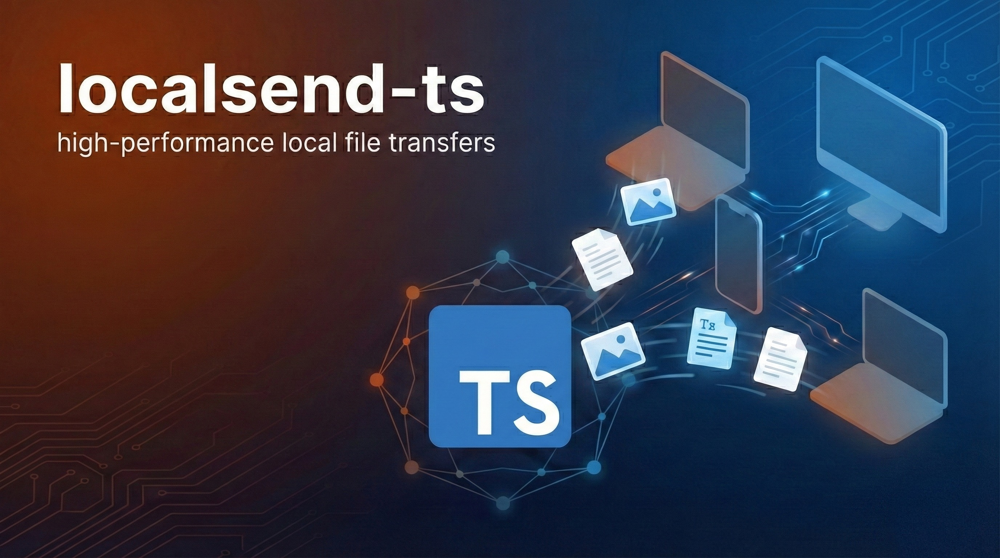

# localsend-ts

<div align="center">
  
</div>

[](https://www.npmjs.com/package/localsend)
[](https://jsr.io/@crosscopy/localsend)

`localsend-ts` is a TypeScript implementation of the [LocalSend](https://localsend.org) protocol
(v2.1) — the same protocol used by the official LocalSend apps to send files over a local network
without an internet connection. It's a library first, CLI second: the core is runtime-agnostic and
runs on **Bun**, **Node.js**, and **Deno**, so you can embed a LocalSend-compatible sender,
receiver, or share server directly in your own app.

The protocol itself is documented at [localsend/protocol](https://github.com/localsend/protocol).

## Install

```bash
bun add localsend
# or
npm install localsend
```

The package also ships a CLI binary (see [CLI usage](#cli-usage) below).

## Library quickstart

All of the following are exported from the `localsend` package root.

### Receive files

```ts
import { LocalSendServer, getDeviceInfo } from "localsend"

const deviceInfo = getDeviceInfo({ alias: "My Receiver" })

const server = new LocalSendServer(deviceInfo, {
	saveDirectory: "./received_files",
	pin: "123456", // optional
	onTransferRequest: async (senderInfo, files) => {
		console.log(
			`${senderInfo.alias} wants to send`,
			Object.values(files).map((f) => f.fileName)
		)
		return true // accept the transfer
	},
	onTransferProgress: async (fileId, fileName, received, total, speed, finished) => {
		if (finished) console.log(`${fileName} received (${total} bytes)`)
	}
})

await server.start()
// ...
await server.stop()
```

### Send files

```ts
import { getDeviceInfo, LocalSendClient } from "localsend"
import type { FileMetadata } from "localsend"
import { createHash } from "node:crypto"
import { readFile } from "node:fs/promises"
import path from "node:path"

const client = new LocalSendClient(getDeviceInfo({ alias: "My Sender" }))
const target = { ip: "192.168.1.42", port: 53317, protocol: "http" as const }

const filePath = "./photo.png"
const fileBytes = await readFile(filePath)
const fileId = createHash("md5").update(filePath).digest("hex")
const fileMetadata: FileMetadata = {
	id: fileId,
	fileName: path.basename(filePath),
	size: fileBytes.length,
	fileType: "image/png",
	sha256: createHash("sha256").update(fileBytes).digest("hex")
}

const prepared = await client.prepareUpload(target, { [fileId]: fileMetadata })
if (prepared && prepared.files[fileId]) {
	await client.uploadFile(target, prepared.sessionId, fileId, prepared.files[fileId], filePath)
}
```

`prepareUpload` sends metadata and waits for the receiver to accept (or reject) the transfer;
`uploadFile` streams the whole file in a single request, exactly as the LocalSend protocol
requires (there is no chunking). If you don't already know the target's protocol,
`client.getDeviceInfo(target)` (or discovery, below) will resolve it for you first.

### Share a link / let others download from you

`LocalSendServer` can also act as a download source: pass `sharedFiles`, and the server exposes
both the LocalSend `prepare-download`/`download` endpoints and a plain browser page at `GET /`.

```ts
import { LocalSendServer, LocalSendClient, getDeviceInfo } from "localsend"

const server = new LocalSendServer(getDeviceInfo({ alias: "Sharer" }), {
	sharedFiles: ["./report.pdf", "./photo.png"]
})
await server.start()

// Any LocalSend client (this library, the official apps, or a browser at http://<ip>:53317/)
// can now download the shared files:
const client = new LocalSendClient(getDeviceInfo({ alias: "Downloader" }))
const target = { ip: "127.0.0.1", port: server.deviceInfo.port, protocol: "http" as const }
const meta = await client.prepareDownload(target)
if (meta) {
	const fileId = Object.keys(meta.files)[0]
	await client.download(target, meta.sessionId, fileId, "./downloaded.pdf")
}
```

### HTTPS

Pass `{ protocol: "https" }` and `LocalSendServer` generates a self-signed certificate on startup
and derives the device `fingerprint` the same way the official apps do
(`SHA-256` of the DER-encoded certificate, uppercase hex) — so discovery and interop work exactly
as they would with a real device.

```ts
const server = new LocalSendServer(getDeviceInfo({ alias: "Secure Receiver" }), {
	protocol: "https",
	saveDirectory: "./received_files"
})
await server.start()
console.log(server.deviceInfo.fingerprint) // uppercase hex, e.g. "247E5F7C..."
```

Clients connect the same way, just with `protocol: "https"` in the target — the client trusts
self-signed certs by default (set `LOCALSEND_INSECURE_TLS=0` to disable that).

### Discovery

`MulticastDiscovery` announces this device and listens for other LocalSend devices on the local
network via UDP multicast (`224.0.0.167:53317` by default, and configurable); `HttpDiscovery` is
an HTTP-scan fallback for networks where multicast doesn't reach.

```ts
import { MulticastDiscovery, HttpDiscovery, getDeviceInfo } from "localsend"

const deviceInfo = getDeviceInfo({ alias: "My Device" })

const discovery = new MulticastDiscovery(deviceInfo)
discovery.onDeviceDiscovered((device) => console.log("Found:", device.alias, device.ip))
await discovery.start()
discovery.announcePresence()
// ...
discovery.stop()

const httpDiscovery = new HttpDiscovery(deviceInfo)
httpDiscovery.onDeviceDiscovered((device) => console.log("Found via HTTP:", device.alias))
await httpDiscovery.startScan()
```

## CLI usage

```bash
npx localsend send <ip> <file>     # send a file to a known IP
npx localsend receive              # start a receiver (multicast + HTTP discovery)
npx localsend discover             # scan the local network for LocalSend devices
```

Run `npx localsend <command> --help` for the full set of flags (custom alias/port, `--pin`,
`--autoAccept`, `--saveDir`, etc). The package also ships `localsend-interactive`, a menu-driven
CLI for interactive send/receive/discover sessions.

### TUI dashboard

Running `localsend` with **no subcommand** opens a full **TUI dashboard** (Send / Receive /
Settings) built with [OpenTUI](https://opentui.com) + Solid.js, modeled on the official LocalSend
app — content-first send, an always-on receiver with incoming-transfer consent, live device
scanning, per-file transfer progress, and favorites:

```bash
localsend                                   # bare command → TUI dashboard
localsend --tui --alias "My Device" --port 8080   # explicit, with options
```

`localsend --help` and `localsend send|receive|discover` stay the plain CLI. The TUI needs a
runtime with FFI for OpenTUI's native renderer — **Bun** (recommended), or **Node.js ≥ 26.4** with
`--experimental-ffi`; under an older Node, `localsend --tui` prints how to run it under Bun while
the rest of the CLI works everywhere. The dashboard is bundled into `dist/cli.js` at build time, so
no separate TUI binary ships.

## Protocol compliance

| Endpoint                             | Method | Status                                        |
| ------------------------------------ | ------ | --------------------------------------------- |
| `/api/localsend/v2/info`             | GET    | ✅                                            |
| `/api/localsend/v2/register`         | POST   | ✅                                            |
| `/api/localsend/v2/prepare-upload`   | POST   | ✅ (PIN support, 204 on empty files)          |
| `/api/localsend/v2/upload`           | POST   | ✅ (whole file, single request — no chunking) |
| `/api/localsend/v2/cancel`           | POST   | ✅                                            |
| `/api/localsend/v2/prepare-download` | POST   | ✅                                            |
| `/api/localsend/v2/download`         | GET    | ✅                                            |
| Browser share page (`GET /`)         | GET    | ✅                                            |

- **Transport**: both plain HTTP and HTTPS (self-signed cert, generated on startup) are supported.
- **Fingerprint**: `SHA-256` of the DER-encoded certificate, uppercase hex — matching the format
  used by the official LocalSend apps.
- **Discovery**: UDP multicast (`224.0.0.167:53317`) with an HTTP-scan fallback.
- **Out of scope**: the v3+ WebRTC/internet transport is not implemented — this library targets
  local-network v2.1 only.

## Testing

The test suite has three layers:

1. **Unit + conformance + interop** (`bun test`) — always runs; covers protocol schemas, session
   stores, path-traversal safety, HTTP and HTTPS transfers between two in-process servers/clients,
   and byte-for-byte upload/download checks.
2. **Docker multicast e2e** (opt-in) — spins up two containers on a shared Docker bridge network
   and confirms real UDP multicast discovery crosses a network boundary between them:
   ```bash
   bun run test:e2e:docker
   ```
   See `docker/README.md` for details (including macOS Docker Desktop networking caveats).
3. **Rust oracle interop** (opt-in) — builds the official LocalSend Rust `core` crate as a
   reference client and runs it against this library's server, verifying the received file is
   byte-identical:
   ```bash
   bun run oracle:build   # one-time: cargo build --release in tools/oracle-rs
   bun run test:oracle
   ```

Plain `bun test` only runs layer 1; the Docker and oracle layers are opt-in and require Docker /
a Rust toolchain respectively, so they're kept out of the default run.

## Interop verified

This implementation has been validated against real LocalSend peers, not just its own tests:

- The HTTPS certificate **fingerprint format** (`SHA-256` of the DER cert, uppercase hex) was
  checked against the official app's own test vector and matches exactly.
- File uploads have been verified against the **official LocalSend Rust `core` client**
  (`tools/oracle-rs`, opt-in `bun run test:oracle`): the client sends a real v2 `prepare-upload` +
  `upload` request and the file received by this library's server is byte-identical to the
  original.
- Multicast discovery has been verified to cross a real network boundary using two isolated Docker
  containers (opt-in `bun run test:e2e:docker`).

## Development

```bash
bun run src/cli.ts receive
deno -A --unstable-sloppy-imports --unstable-net src/cli.ts receive --alias deno-client
```

See `examples/` for more complete, runnable snippets (basic sender/receiver, Hono server, RPC
client, and runtime-adapter selection).
